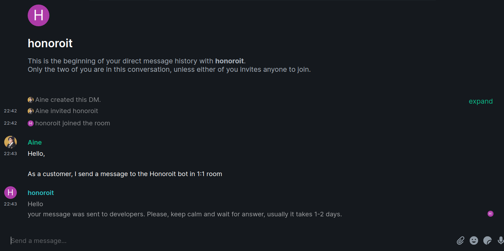
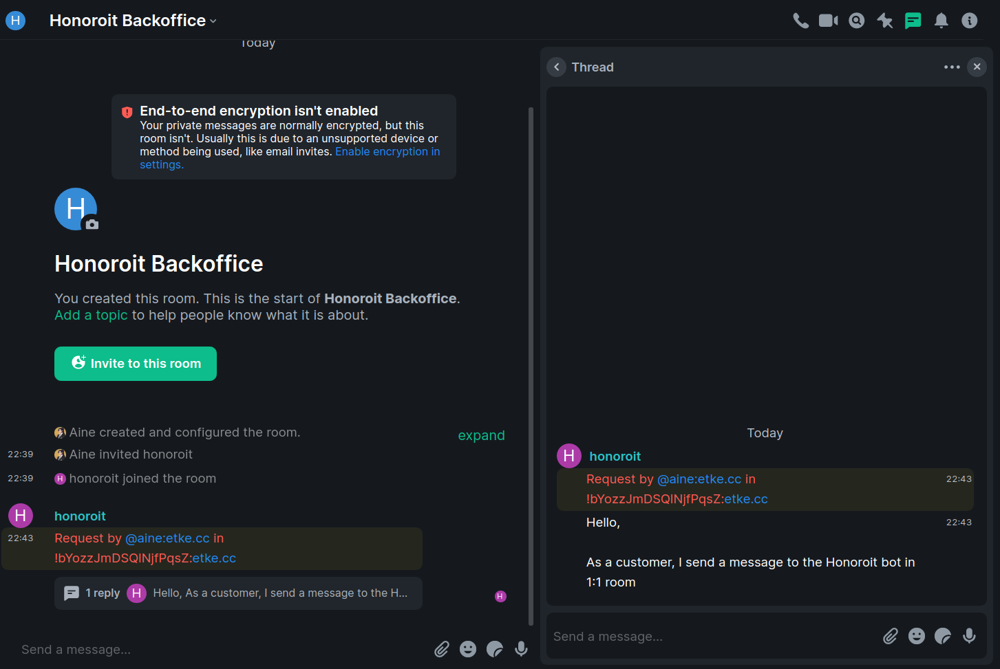
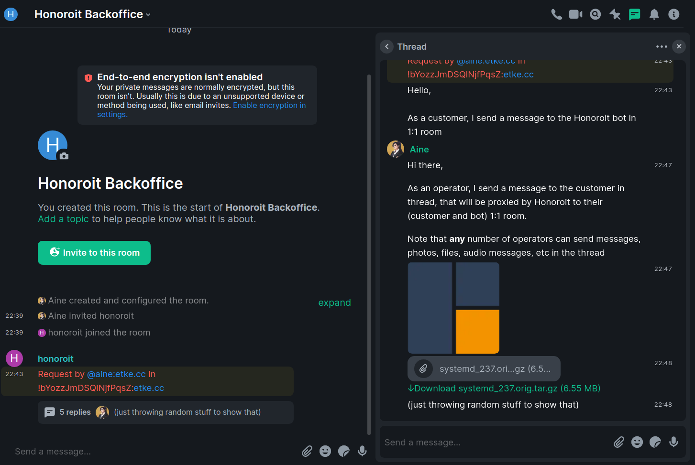
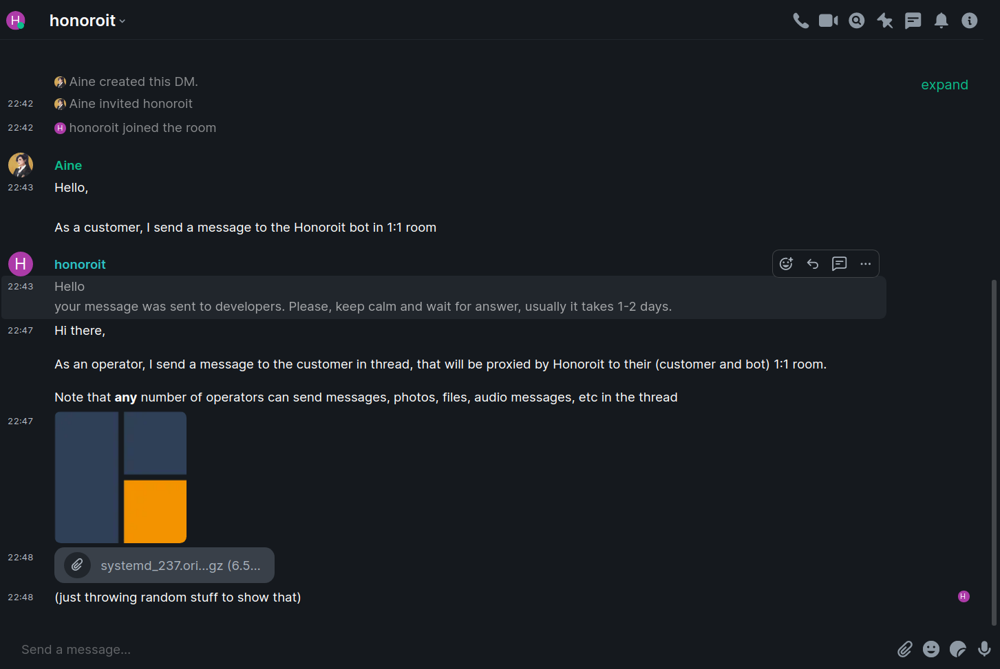
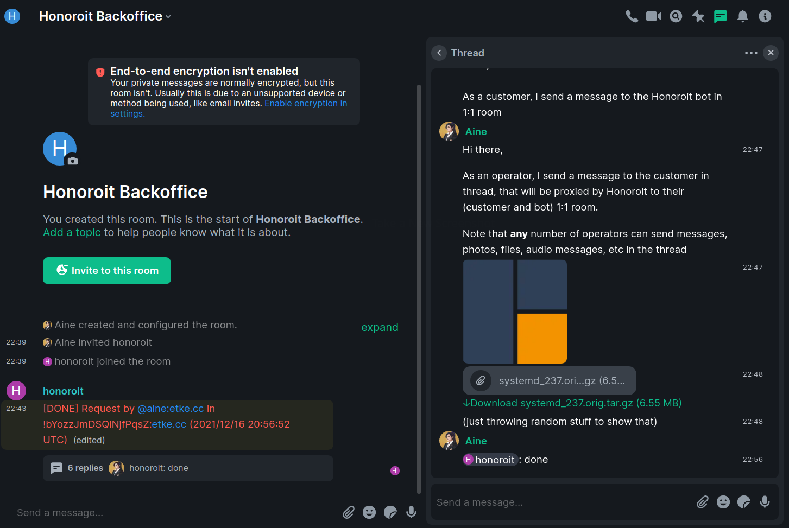
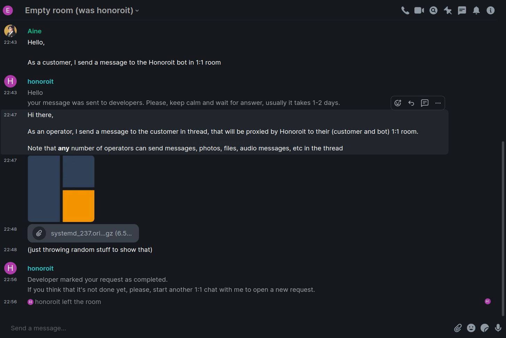

# Honoroit    

> [more about that name](https://finalfantasy.fandom.com/wiki/Honoroit_Banlardois)

A helpdesk bot, used as part of [etke.cc](https://etke.cc) service.

The main idea of that bot is to give you the same abilities as with website chats (like Intercom, jivosite, etc) inside the matrix.

## Features

* End-to-End encryption
* Get a message from any matrix user proxied to a specific room. Any message that user will send in his 1:1 room with Honoroit will be proxied as thread messages
* Chat with that user through the honoroit bot in a thread inside your special room. Any member of that special room can participate in discussion
* When request fulfilled - send a `!ho done` in that thread - thread topic will be renamed and "proxied user" will know that request was closed (bot will leave user's room with special notice)

## How it looks like

Screenshots

### Step 1: a matrix user (customer) sends a message to Honoroit bot in direct 1:1 chat

### Step 2: a new thread created in the backoffice room

### Step 3: operator(-s) chat with customer in that thread

### Step 4: customer sees that like a direct 1:1 chat with honoroit user

### Step 5: operator closes the request

### Step 6: customer receives special message and bot leaves the room

## TODO

* Unit tests

## Commands

Available commands in the threads. Note that all commands should be called with prefix, so `!ho done` will work, but simple `done` will not.

* `done` - close the current request and mark is as done. Customer will receive special message and honoroit bot will leave 1:1 chat with customer. Any new message to the thread will not work and return error.
* `rename` - rename the thread topic title, when you want to change the standard message to something different
* `note` - a message prefixed with `!ho note` will **not** be sent anywhere, it's a safe place to keep notes for other operations in a thread with a customer, example: `!ho note @room need help with this one`
* `invite` - invite yourself into the customer 1:1 room
* `start MXID` - start a conversation with a MXID from the honoroit (like a new thread, but initialized by operator), eg: `!ho start @user:example.com`

## Configuration

env vars

### mandatory

* **HONOROIT_HOMESERVER** - homeserver url, eg: `https://matrix.example.com`
* **HONOROIT_LOGIN** - user login/localpart, eg: `honoroit`
* **HONOROIT_PASSWORD** - user password
* **HONOROIT_ROOMID** - room ID where threads will be created, eg: `!test:example.com`

### optional

#### honoroit internals

* **HONOROIT_PREFIX** - command prefix
* **HONOROIT_SENTRY** - sentry DSN
* **HONOROIT_LOGLEVEL** - log level
* **HONOROIT_CACHESIZE** - max allowed mappings in cache
* **HONOROIT_NOENCRYPTION** - disable e2e encryption support
* **HONOROIT_IGNOREDROOMS** - space separated list of roomIDs to ignore
* **HONOROIT_IGNORENOTHREAD** - completely ignore messages outside of threads
* **HONOROIT_DB_DSN** - database connection string
* **HONOROIT_DB_DIALECT** - database dialect (postgres, sqlite3)

#### text messages

* **HONOROIT_TEXT_PREFIX_OPEN** - prefix of a new thread topic
* **HONOROIT_TEXT_PREFIX_DONE** - prefix of a closed thread topic
* **HONOROIT_TEXT_GREETINGS** - a message sent to customer on first contact
* **HONOROIT_TEXT_NOENCRYPTION** - a message sent to customer when encryption disabled and customer tries to use encrypted chat
* **HONOROIT_TEXT_JOIN** - a message sent to backoffice/threads room when a customer joins a room
* **HONOROIT_TEXT_INVITE** - a message sent to backoffice/threads room when a customer invites another user
* **HONOROIT_TEXT_LEAVE** - a message sent to backoffice/threads room when a customer leaves a room
* **HONOROIT_TEXT_ERROR** - a message sent to customer if something goes wrong
* **HONOROIT_TEXT_EMPTYROOM** - a message sent to backoffice/threads room when the last customer left a room
* **HONOROIT_TEXT_START** - a message sent to thread when using `start` command
* **HONOROIT_TEXT_DONE** - a message sent to customer when request marked as done in the threads room

You can find default values in [config/defaults.go](config/defaults.go)

## Where to get

[docker registry](https://gitlab.com/etke.cc/honoroit/container_registry), [etke.cc](https://etke.cc)
